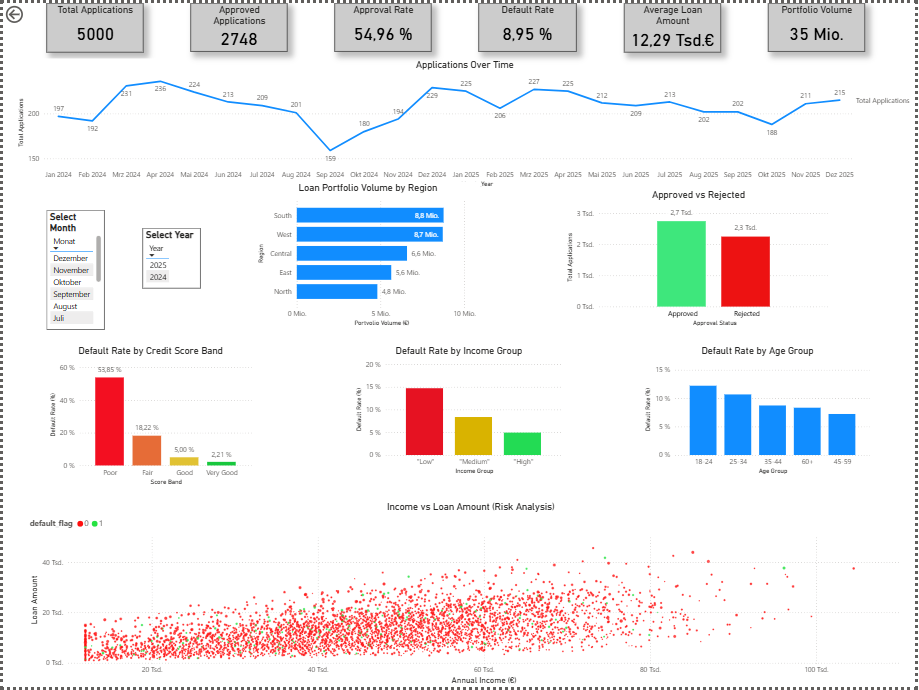

# 💳 Credit Risk Analytics Dashboard (Power BI)

## 🚀 Business Problem

Banks need to monitor credit risk to avoid financial losses caused by loan defaults.
Without clear KPIs, risk management becomes inefficient and decisions are harder to justify.

---

## 📊 Solution

Developed an interactive Power BI dashboard to track **credit risk metrics and financial performance**.
The dashboard enables stakeholders to quickly identify risks, trends, and opportunities.

---

## 📈 Key Metrics

* Default Rate (%)
* Total Loan Volume
* Average Risk Score
* Approval Rate
* Risk Segment Distribution

---

## 📈 Key Features

* Default Rate monitoring
* Loan distribution analysis
* Risk score segmentation
* Time-based trend analysis

---

## 📊 Key Insights

* Identified high-risk customer segments
* Detected patterns in loan defaults
* Enabled faster risk evaluation through interactive filters

---

## 💰 Business Impact

* Supports data-driven risk management decisions
* Reduces potential financial losses
* Improves transparency for stakeholders
* Enables faster and more efficient reporting

---

## 🖥️ Dashboard Preview

---

## 📐 DAX Measures

* Default Rate = Defaults / Total Loans
* Average Risk Score
* Total Loan Volume

---

## 🧩 Data Model

* Star Schema structure
* Fact table: Loans
* Dimension tables: Customers, Time

---

## ⚙️ Tech Stack

* Power BI
* DAX (KPIs & Measures)
* Data Modeling (Star Schema)

---
